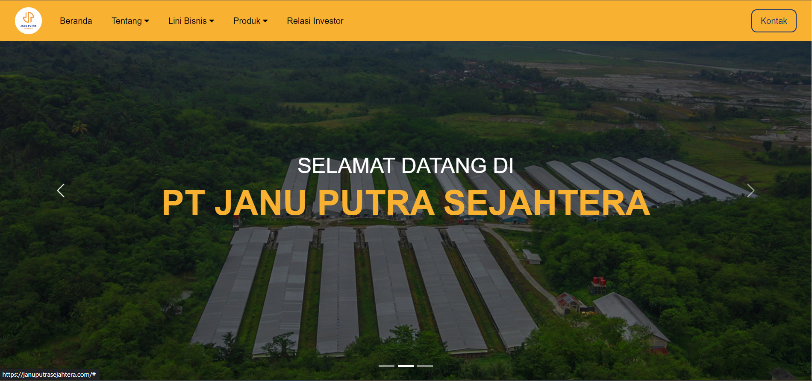
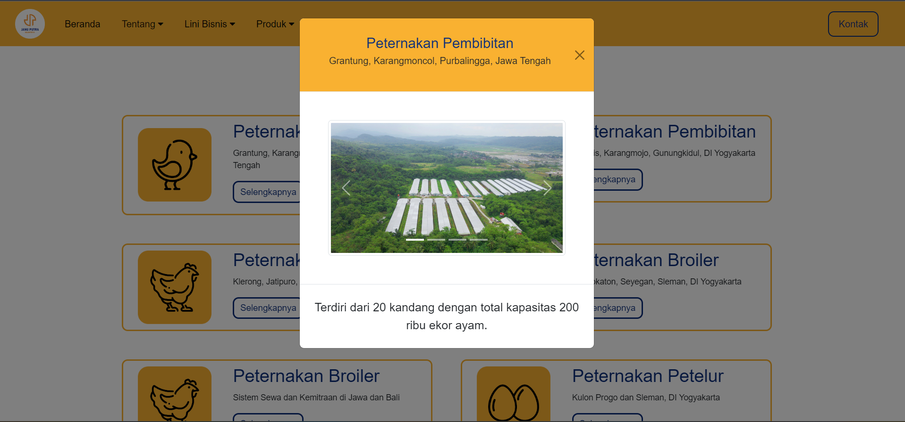
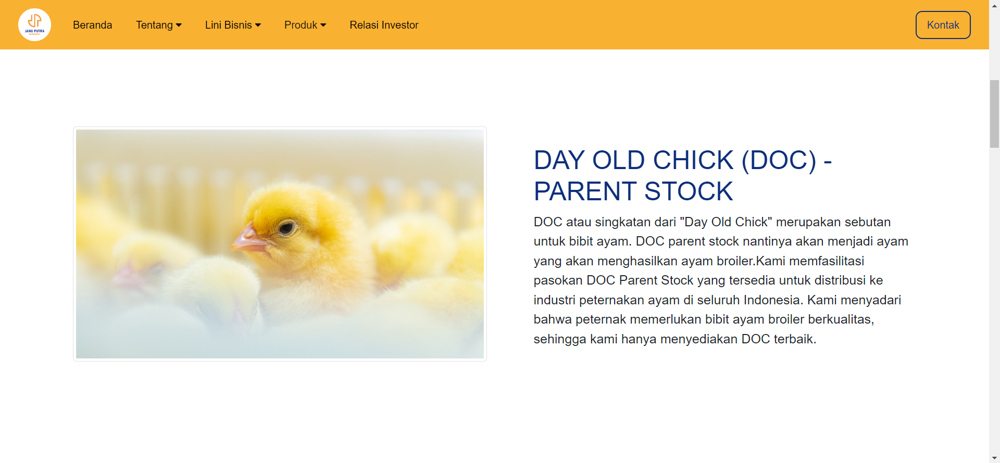
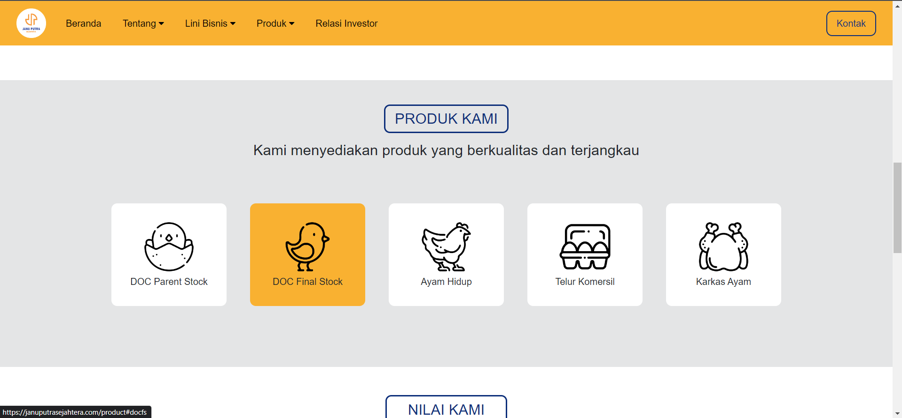

# Company Website Profile Using react.js
Create responsive company wabsite profile using react.js and react-bootstrap.

## Table Content
- About The Project
- Screenshot
- Technologies

## About This Project
This website are builded using react js to improve the performance and improve the userr experience for this website. This website also using react-router-dom to make this website no need to reload to go to another pages. 

## Screenshot
Here is some example of website sneakpeek, or you can easily access it from  [this link](https://januputrasejahtera.com/).
    

## Techonologies
- React.js
- Bootstrap
- React Bootstrap
- React Router DOM
